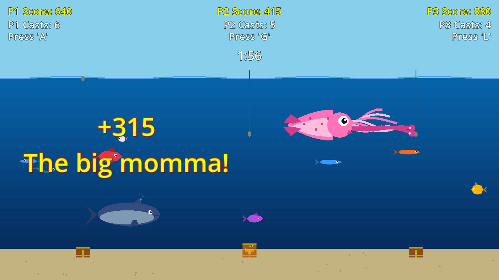

# Fun Family Fishing

A couch-competitive arcade fishing game for **three players on one keyboard**, built in
Godot 4. Drop your line, race to land the biggest haul, dodge the electric eels, and try
not to be the last one still casting.



## Playing

| Player | Cast key |
|--------|----------|
| Player 1 (left) | **A** |
| Player 2 (middle) | **G** |
| Player 3 (right) | **L** |

Each player gets **10 casts** in a **2 minute** round. Tap your key to drop the hook;
whatever it touches on the way down comes up with it. Deeper fish and faster fish are
worth more, and a bigger fish will steal your catch right off the hook while you reel.

Cast something within the first 45 seconds or you forfeit the round.

## What's in the water

- **Regular fish** in 5 body shapes and 10 colors, from 10 to 50 base points
- **Electric eels and jellyfish** — hook one and it costs you 50 points
- **Treasure chests**, one per player, that pop open a couple of times a minute for 300 points
- **A whale**, once a round, worth up to 315 points
- **A shark**, worth up to 472 points
- **A giant pink squid** that materializes anywhere on the board with a shrill squeal, fades
  in over three seconds — untouchable while it does — then heads for the far wall

## End of round bonuses

After the timer runs out, the bonus screen tallies up arcade-style awards worth 100 points each:

- **FIRST DONE!** — 100 for every rival you finished your casts ahead of
- **ALL 3 BEASTS!** — land the whale, the shark, and the squid in one round
- **TREASURE HUNTER!** — collect more than one chest
- **SHOCK FREE!** — get through the round without hooking anything electric
- **SMALLEST FISH!** and **BIGGEST FISH!** — for the shortest and longest fish of the round

Bonuses are added before the winner is announced, so they can flip the result.

## Leaderboard

The all-time **top ten** appears at the end of every round. If the winning score beats
tenth place, the winner types a name (up to 8 characters) and it's saved to
`user://leaderboard.json`, so the board survives between sessions.

## Running it

Requires [Godot 4](https://godotengine.org/download) (built and tested on 4.7, GL
Compatibility renderer, 1280x720).

```bash
git clone https://github.com/michaelraney/fun-family-fishing.git
cd fun-family-fishing
godot --path .
```

Or open the folder in the Godot editor and press play.

## Under the hood

Every fish, creature, chest, and wave is drawn procedurally in GDScript `_draw()` calls —
there are no image assets. The sound effects are generated as raw `AudioStreamWAV` samples
at startup, so the whole game is code.

```
scenes/     Scene files for the board, fish, creatures, and chests
scripts/    Game logic, procedural art, and the sound generator
docs/       Screenshot
GAME_RULES.md   Full rules, scoring formulas, and spawn rates
```

See **[GAME_RULES.md](GAME_RULES.md)** for the complete rules, exact score formulas, and
spawn tables.
